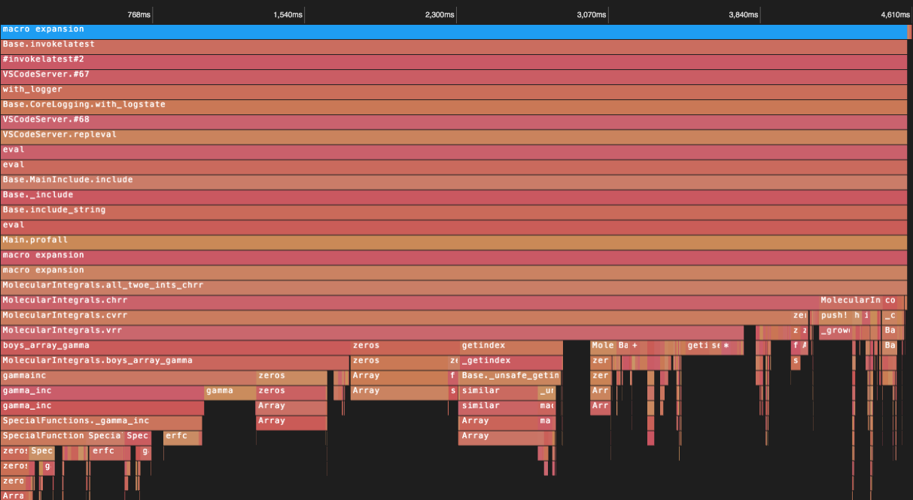

[tl;dr] I'm trying to write a fast code to evaluate quantum chemistry electron repulsion integrals in Julia, and would welcome help on how to improve the performance of [the code I already have](https://github.com/rpmuller/MolecularIntegrals.jl/blob/master/src/HGP.jl).

The fast codes currently in use generate code that is then compiled, using either C++ template metaprogramming [1] or using a common lisp script to write C code [2]. Codes written in modern languages like Python [3] are many times slower, and now typically just wrap one of the fast packages [1,2].

I think there's an opportunity to write a fast package in Julia that would also be readable and hackable. I've put together working code in the package MolecularIntegrals.jl [4], which is much faster than the pure python code. But it's still slower than Libint or Libcint.

Like I said, I have fairly decent Julia code in [5] (see the [HGP.jl](https://github.com/rpmuller/MolecularIntegrals.jl/blob/master/src/HGP.jl) file). To make this code as fast as it is, I've read through and checked everything in the [Julia Performance Tips](https://docs.julialang.org/en/v1/manual/performance-tips/) page and @ChrisRackauckas [7 Julia Gotchas and How to Handle Them](https://www.stochasticlifestyle.com/7-julia-gotchas-handle/) blog post.

I'd love to have advice on how improve the performance the code. The best algorithms in common use make use of recurrence relations [5] to generate integrals for higher angular momentum basis functions in terms of the lower angular momentum integrals, which are ultimate worked on in terms of incomplete error functions. These methods involve a certain amount of irregular memory access, which is one of the things that I believe has required the use of code generation in C/C++.

I believe there are still performance gains to be had, because the head to head timing of my code against those C/C++ libraries shows that the Julia code is still 5-10 times slower.

I have done a lot of profiling. A typical case is shown below:

Most of the time is taken by the `vrr` routine, and most of that time is taken computing the `boys_array_gamma` function.

One of the things that puzzles me is that macros like `@inbounds` and `@avx` that people regularly use to speed code if anything slow down my code.

I've written some hand-optimized Julia code in the [HGPgen.jl](https://github.com/rpmuller/MolecularIntegrals.jl/blob/master/src/HGPgen.jl) file that produces Julia files code that don't have any loops or conditionals. That code used to be much faster, but after the last round of performance improvements, especially using @code_warntype, the regular Julia code is now faster. But I'm keeping the generated code around since that approach is so important in the C/C++ integral libraries.

References
[1] [Libint: high-performance library for computing Gaussian integrals in quantum mechanics](https://github.com/evaleev/libint)
[2] [General GTO integrals for quantum chemistry](https://github.com/sunqm/libcint)
[3] [PyQuante](https://github.com/rpmuller/pyquante2)
[4] [MolecularIntegrals.jl](https://github.com/rpmuller/MolecularIntegrals.jl)
[5] [A method for two-electron Gaussian integral and integral derivative evaluation using recurrence relations](https://doi.org/10.1063/1.455553). Martin Head-Gordon and John A. Pople. JCP, 89 (9), 5777, 1988.